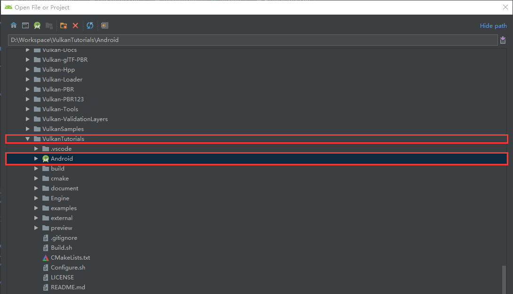
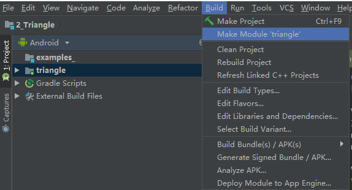
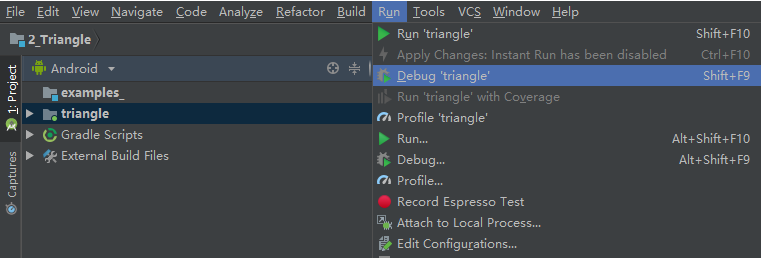

# Android环境搭建步骤

- Android *Studio*：3.2+
- NDK：r16b+

1、安装Android Studio以及NDK，照着网上的教程弄，然后安装最新的Android SDK即可。

2、打开Android Studio，选择Open Project。

选择**源码**目录下的**Android**目录，就是有小图标的那个。

3、构建，调试。

选中要构建的**模块**，然后通过菜单**Build**来构建，例如：**Make Module 'triangle'**。

构建好之后，连接手机即可安装调试。通过菜单**Run**，例如**Debug 'triangle'**。

