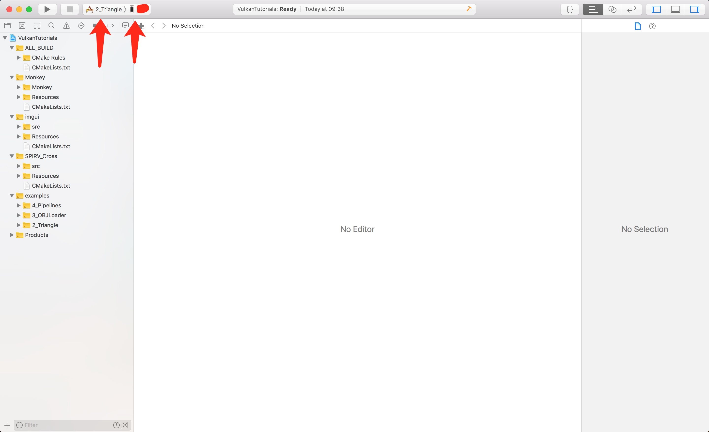
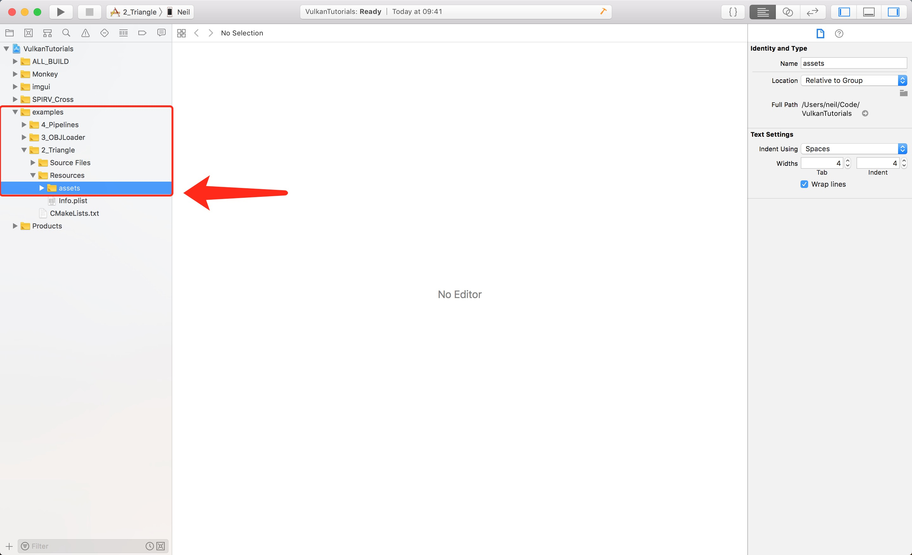
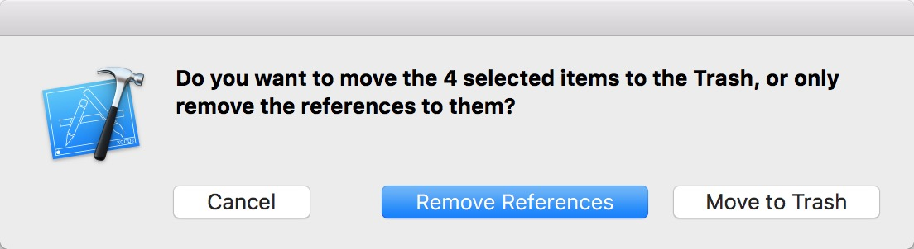
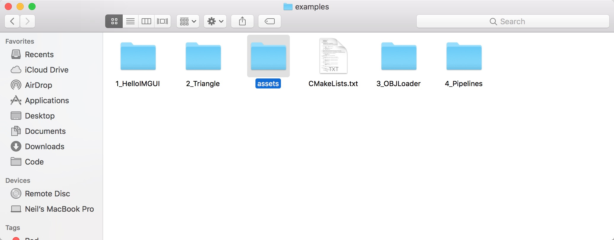
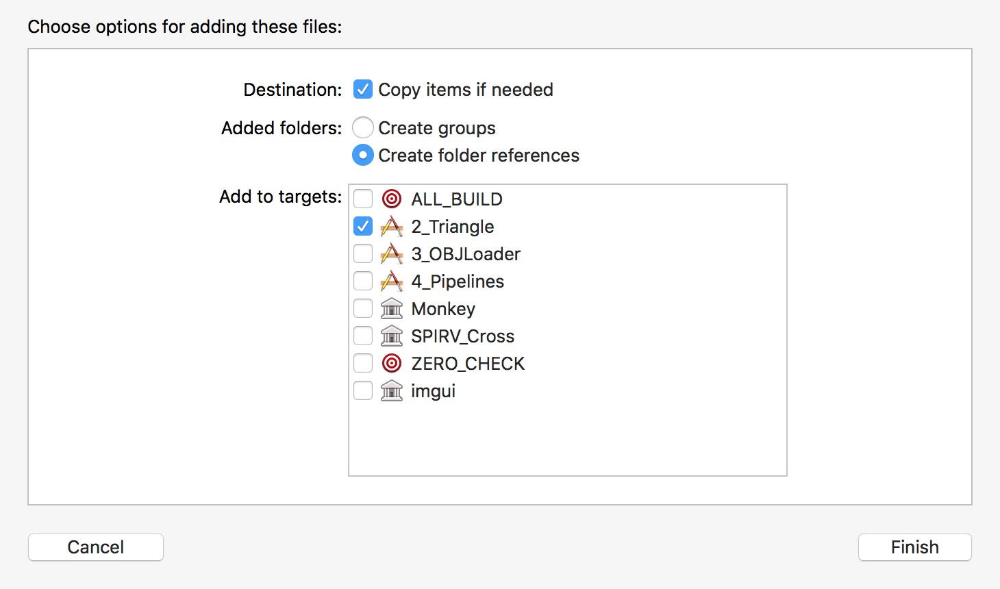
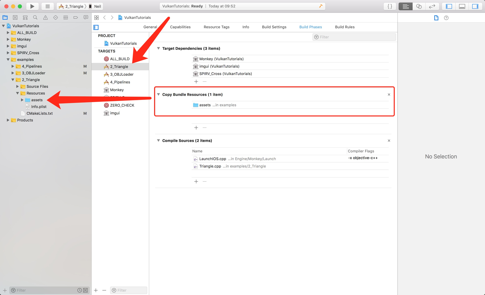
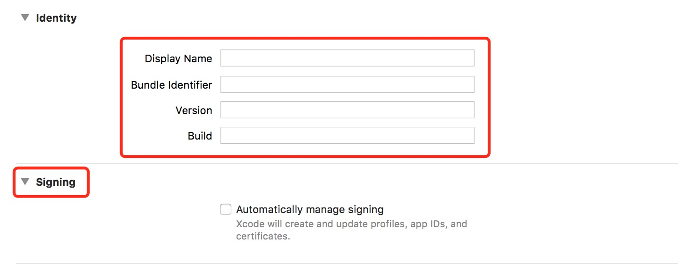
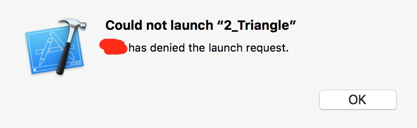
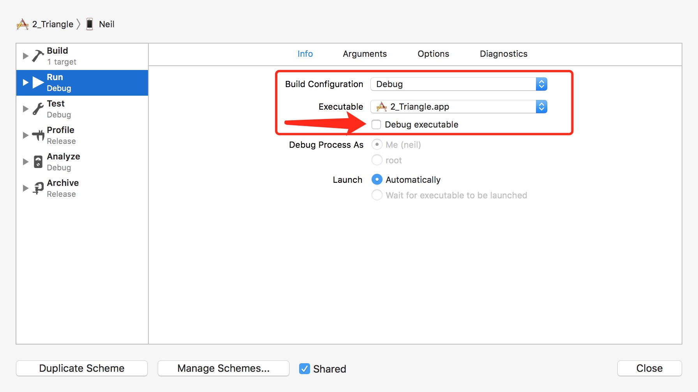

# IOS环境搭建步骤

- 安装最新版本的CMake
- 安装最新版本的XCode
- 使用最新的操作系统

0、打开Terminal，定位到根目录

1、在根目录创建build_ios目录

```shell
mkdir build_ios
cd build_ios
# VulkanTutorials/build_ios
```

2、创建Xcode工程

```shell
cmake .. -G Xcode -DCMAKE_TOOLCHAIN_FILE=../cmake/ios.toolchain.cmake -DIOS_PLATFORM=OS64
```

3、打开Xcode工程，修改配置。PS:有部分配置需要自己修改，我找了几天都没法搞定这个事情。

```shell
open VulkanTutorials.xcodeproj
```

- 修改构建对象以及调试设备，注意Metal只能在真机调试，因为Vulkan是通过MoltenVK对Metal的一个包装，底层还是用的Metal，因此Vulkan也只能真机调试。



- 移除每个Target的资源目录

将对应Target下Resources目录的assets目录移除掉。





- 添加资源目录，将examples/assets目录拖拽到Resources目录下





注意选项跟上图选项保持一致。然后检查是否配置成功。



最后配置好开发者账号，应用程序名称，就可以真机运行了。



如果有遇到这样的问题，关闭debug选项。





