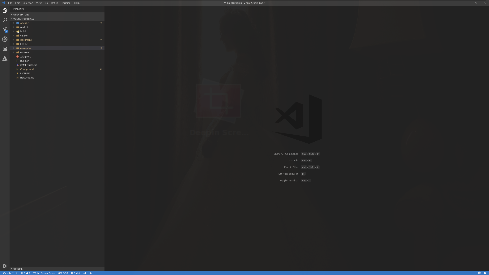
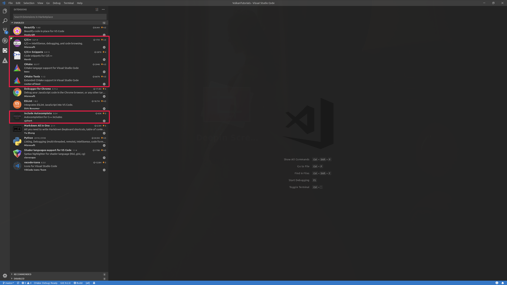
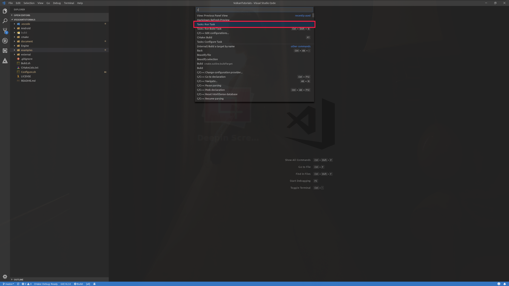
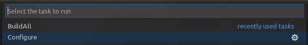
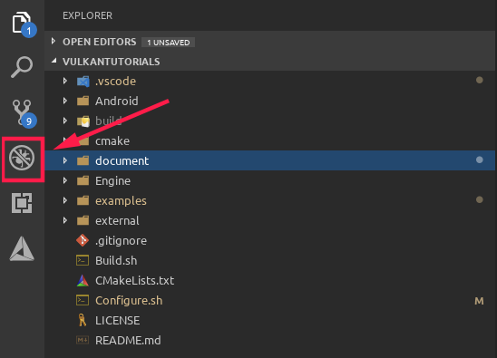
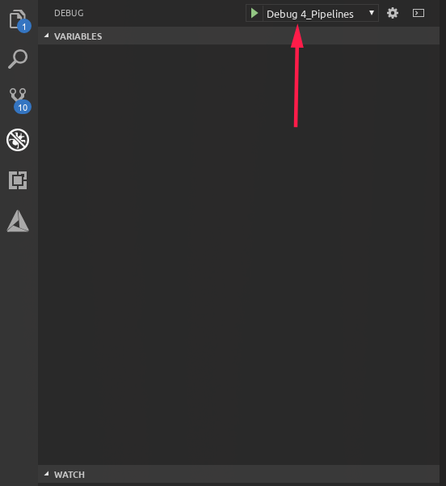

# Ubuntu18.04 环境搭建步骤

- 安装最新版本的CMake
- 安装最新版本的VSCode
- 安装XCB库
- Ubuntu 18.04

0、打开Terminal,定位到根目录,执行以下命令安装xcb库.

```shell
sudo apt-get update
sudo apt-get install xcb
```

1、打开VSCode,通过VSCode打开工程目录.




2、安装VSCode插件.



3、通过CMake生成Makefile文件,按Control+Shift+P调出命令,选择Run Task.



然后选择Configure选项



4、编译所有项目

按Control+Shift+P调出命令 -> 选择Run Task -> BuildAll


5、调试

切换到调试面板



选择需要调试的应用程序进行调试.

