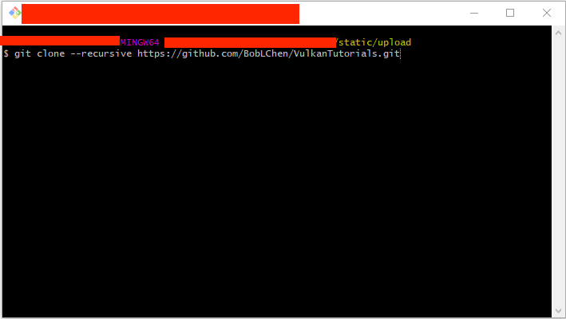
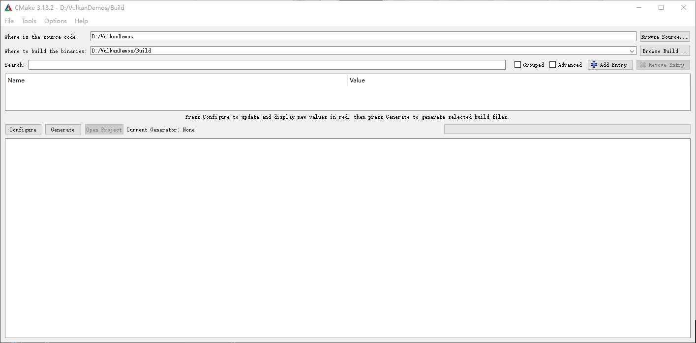
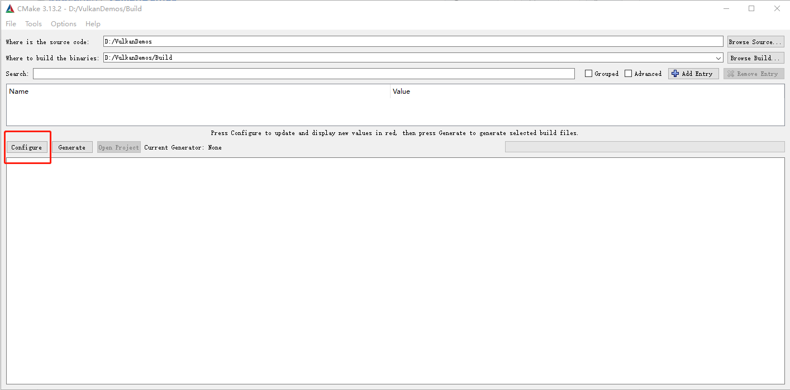
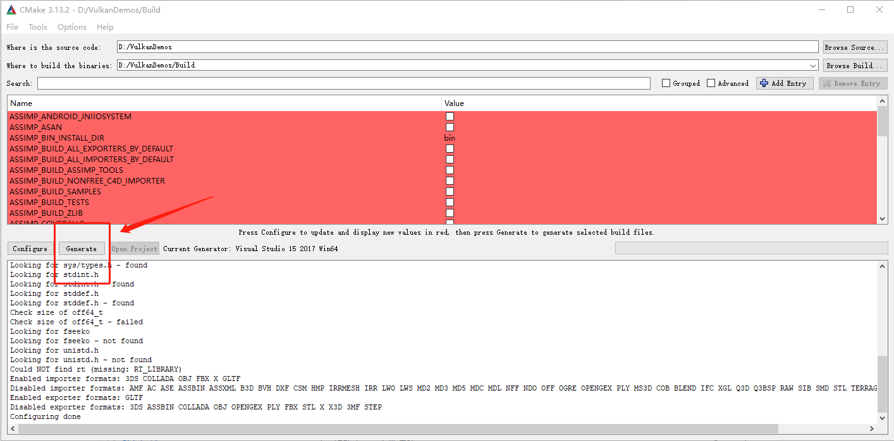

# Windows环境搭建步骤

- 安装Visual Studio 2017 64位版本
- 安装最新版本的CMake
- 安装最新版本的Vulkan SDK

0、下载安装Vulkan SDK，无脑下一步即可。如果不安装则不能用Vulkan的校验功能。https://www.lunarg.com/vulkan-sdk/

1、随便找个地方，右键Git Bash


2、在那个黑框中输入

```git clone https://github.com/BobLChen/VulkanDemos.git```

**PS:不要下载ZIP包，必须使用Git.**




3、下载好了代码之后，打开CMake，填入项目路径。




4、填好之后，点击```Configure```按钮，然后在弹出框选择VS2017 Win64，其它默认，点击Finish即可。





5、最后点击```Generate```生成VS2017工程。生成好之后，点击```Open Project```，打开之后选中任意examples目录下的项目```右键设置为启动项```即可。



