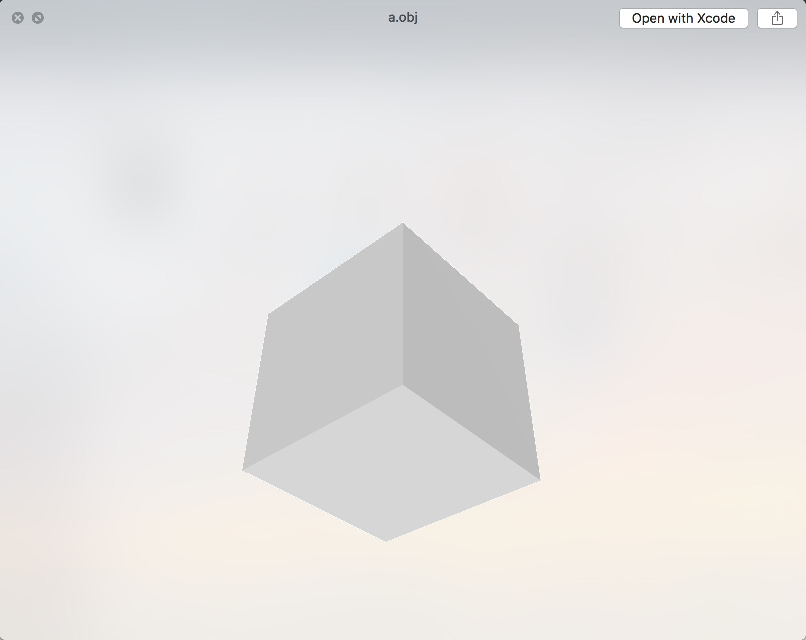

# 载入OBJ格式文件

只是显示三角形还远远不够，我们需要真正的显示出一个3D模型才算是开始。3D模型格式非常非常多，可以罗列出几十种，用得比较多的库是`assimp`：https://github.com/assimp/assimp。目前我们先暂时使用最基础的格式：OBJ，如果OBJ可以正常使用，那么其它格式的模型文件也一样可以使用，后期我打算使用fbk格式，fbx格式已经成为了跨平台(Max、Maya、Blender等)的主流格式。fbx有autodesk提供的c++ sdk以及python bind的sdk，如果对这个有兴趣可以先研究一下我几年前用python写的解析脚本：https://github.com/BobLChen/fbx-stage3d。

## OBJ文件的基本结构
OBJ文件由一行行文本组成，注释行以符号“#”为开头，空格和空行可以随意加到文件中以增加文件的可读性。数据行都以特殊关键字为起始标识。下列关键字可以在OBJ文件使用。在这个列表中, 关键字根据数据类型排列，每个关键字有一段简短描述。

### 顶点数据(Vertex data)

- vt  贴图坐标点(Texture vertices)
- vn 顶点法线(Vertex normals)
- v   顶点几何数据
- vp 参数空格顶点 (Parameter space vertices)

### 自由形态曲线(Free-form curve)/表面属性(surface attributes)

- deg 度(Degree)
- bmat 基础矩阵(Basis matrix)
- step 步尺寸(Step size)
- cstype 曲线或表面类型 (Curve or surface type)

### 元素(Elements)

- p 点(Point)
- l 线(Line)
- f 面(Face)
- curv 曲线(Curve)curv2 
- 2D曲线(2D curve)
- surf 表面(Surface)

### 成组(Grouping)

- g 组名称(Group name)
- s 光滑组(Smoothing group)
- mg 合并组(Merging group)
- o 对象名称(Object name)

## OBJ文件示例

我们可以通过编辑文本文件来创建一个OBJ文件。我们可以尝试不用3D建模软件，手动编写一个四边形。打开文本编辑器(Sublime、VSCode等)，把下面的5行代码写入，可以适当加一点注释。保存文件为文本格式，文件名为"myObj.obj"。

```shell
# cube.obj
#
 
g cube
 
v  0.0  0.0  0.0
v  0.0  0.0  1.0
v  0.0  1.0  0.0
v  0.0  1.0  1.0
v  1.0  0.0  0.0
v  1.0  0.0  1.0
v  1.0  1.0  0.0
v  1.0  1.0  1.0

vn  0.0  0.0  1.0
vn  0.0  0.0 -1.0
vn  0.0  1.0  0.0
vn  0.0 -1.0  0.0
vn  1.0  0.0  0.0
vn -1.0  0.0  0.0
 
f  1//2  7//2  5//2
f  1//2  3//2  7//2 
f  1//6  4//6  3//6 
f  1//6  2//6  4//6 
f  3//3  8//3  7//3 
f  3//3  4//3  8//3 
f  5//5  7//5  8//5 
f  5//5  8//5  6//5 
f  1//4  5//4  6//4 
f  1//4  6//4  2//4 
f  2//1  6//1  8//1 
f  2//1  8//1  4//1 
```

保存之后，如果是Window10系统或者MacOS系统，应该可以直接预览到我们生成好的模型。



## OBJ加载库

obj格式只是一种明文的非常简单的文本格式，我们可以通过解析字符串解析出我们需要的信息。由于obj格式太过于简单，这么多年写过好多关于它的解析工具，哪怕是几行代码现在也不太想写了，为了偷懒我用了一个现成的obj解析代码https://github.com/syoyo/tinyobjloader。可以在`Engine/Monkey/Loader/tiny_obj_loader.h`找到对应源码。

## Vulkan中加载obj

在Vulkan里面显示单个obj模型其实跟显示一个三角形没有任何区别。一个三角形是3个顶点3个索引一个面，一个模型多个顶点多个索引多个面而已，只是从1变成了N，也就是我们代码里面的1变成了N。

但是在之前的demo中，我们会发现设置顶点数据和Buffer以及设置索引数据和Buffer异常繁琐，为了在后续的demo不必这么繁琐，我们需要对这两块数据进行简单封装。

## VertexBuffer

VertexBuffer的源码可以在`Engine/Monkey/Graphics/Data/VertexBuffer.h|cpp`找到。我对VertexBuffer简单封装了一下，将stream以及vertex的属性抽离出来。首先看Stream，Stream指代一段内存，该段内存存储了几个顶点属性(Channel)。比如stream0存储Position、Normal；stream1存储uv0、Color等等。为了能够让大家都用上灵活自由的顶点布局，就设计成了如下这个样子，这个其实也是我这么多年来一直在用的布局格式。我尝试过其它布局方式，例如限定格式，必须为Positin、Color、UV0、Normal等排布方式。综合尝试下来，最后还是喜欢我当初设计的这种部件。

```c++
struct VertexStreamInfo
{
	uint32 channelMask;
	uint32 size;
    uint32 alignment;
	uint32 allocationSize;
    
	VertexStreamInfo()
		: channelMask(0)
        , size(0)
        , alignment(0)
		, allocationSize(0)
	{
        
	}

	FORCEINLINE void Reset()
	{
		*this = VertexStreamInfo();
	}

	FORCEINLINE bool operator == (const VertexStreamInfo& rhs) const
	{
		return channelMask == rhs.channelMask && size == rhs.size && alignment == rhs.alignment && allocationSize == rhs.allocationSize;
	}
    
	FORCEINLINE bool operator != (const VertexStreamInfo& rhs) const
	{
		return !(*this == rhs);
	}
};
```

Stream只是简单描述了顶点数据的长度，已经存储的顶点属性。具体的信息其实都存储到了Channel中。

```c++
struct VertexChannelInfo
{
	uint8             stream;
	uint8             offset;
	VertexElementType format;
	VertexAttribute   attribute;

	VertexChannelInfo()
		: stream(0)
		, offset(0)
		, format(VertexElementType::VET_None)
		, attribute(VertexAttribute::VA_None)
	{

	}

	FORCEINLINE void Reset()
	{
		*this = VertexChannelInfo();
	}

	FORCEINLINE bool operator == (const VertexChannelInfo& rhs) const
	{
		return stream == rhs.stream && offset == rhs.offset && format == rhs.format && attribute == rhs.attribute;
	}

	FORCEINLINE bool operator != (const VertexChannelInfo& rhs) const
	{
		return !(*this == rhs);
	}
};
```

在Channel中会指定该Channel处于哪一个Stream，该Channel对应的顶点属性，顶点属性的数据格式，在Stream中的偏移量。(指定了顶点数据属性，单并不代表就可以限制顶点类型，例如2D UI里面Position的数据就只需要2个float)

通过Stream以及Channel信息，我们其实已经可以构造出Vulkan需要的一部分`VkVertexInputAttributeDescription`数据信息，之所以说是一部分，因为绑定的信息在Shader里面。不同的Shader有着不同的布局，Shader的代码决定这我们最终如何绑定。即VertexBuffer提供stream、channel信息，Shader提供bind layout信息，最终两者合并。我会为`VertexInputDeclareInfo`生成一个hash key，用来检测stream channel是否发生了变化，同时可以决定是否缓存一些状态。

```c++
class VertexInputDeclareInfo
{
public:
	struct BindingDescription
	{
		uint32_t            binding;
		uint32_t            stride;
		VkVertexInputRate   inputRate;
	};

	struct AttributeDescription
	{
		uint32_t			binding;
		VkFormat			format;
		uint32_t			offset;
		VertexAttribute		attribute;
	};

public:
	VertexInputDeclareInfo()
		: m_Valid(false)
		, m_hash(0)
	{

	}

	FORCEINLINE void AddBinding(const BindingDescription& binding)
	{
		m_Valid = false;
		m_Bindings.push_back(binding);
	}

	FORCEINLINE void AddAttribute(const AttributeDescription& attribute)
	{
		m_Valid = false;
		m_InputAttributes.push_back(attribute);
	}

	FORCEINLINE uint32 GetHash() const
	{
		return m_hash;
	}

	FORCEINLINE void Clear()
	{
		m_Valid = false;
		m_hash  = 0;
		m_Bindings.clear();
		m_InputAttributes.clear();
	}

	FORCEINLINE const std::vector<BindingDescription>& GetBindings() const
	{
		return m_Bindings;
	}

	FORCEINLINE const std::vector<AttributeDescription>& GetAttributes() const
	{
		return m_InputAttributes;
	}

	FORCEINLINE void Update()
	{
		if (!m_Valid)
		{
			m_hash  = 0;
			m_hash  = Crc::MemCrc32(m_Bindings.data(), int32(m_Bindings.size() * sizeof(BindingDescription)));
			m_hash  = Crc::MemCrc32(m_InputAttributes.data(), int32(m_InputAttributes.size() * sizeof(AttributeDescription)), m_hash);
			m_Valid = true;
		}
	}

protected:
	bool	m_Valid;
	uint32	m_hash;

	std::vector<BindingDescription>		m_Bindings;
	std::vector<AttributeDescription>	m_InputAttributes;
};
```

最后才是我们的VertexBuffer定义。

```c++
class VertexBuffer
{
public:
	
	VertexBuffer();

	virtual ~VertexBuffer();
    
	void AddStream(const VertexStreamInfo& streamInfo, const std::vector<VertexChannelInfo>& channels, uint8* dataPtr);

	FORCEINLINE int32 GetStreamCount() const
    {
        return int32(m_Streams.size());
    }

	FORCEINLINE int32 GetStreamIndex(VertexAttribute attribute) const
    {
        uint32 channelMask = 1 << attribute;
        for (int32 i = 0; i < m_Streams.size(); ++i)
        {
            if (m_Streams[i].channelMask & channelMask)
            {
                return i;
            }
        }

        return -1;
    }

	FORCEINLINE int32 GetChannelIndex(VertexAttribute attribute) const
	{
		for (int32 i = 0; i < m_Channels.size(); ++i)
		{
			if (m_Channels[i].attribute == attribute)
			{
				return i;
			}
		}

		return -1;
	}

	FORCEINLINE const VertexStreamInfo& GetStream(int32 index) const
	{
		return m_Streams[index];
	}

	FORCEINLINE const VertexChannelInfo& GetChannel(int32 index) const
	{
		return m_Channels[index];
	}

	FORCEINLINE const VertexStreamInfo& GetStream(VertexAttribute attribute) const
	{
		int32 index = GetStreamIndex(attribute);
		return GetStream(index);
	}

	FORCEINLINE const VertexChannelInfo& GetChannel(VertexAttribute attribute) const
	{
		int32 index = GetChannelIndex(attribute);
		return GetChannel(index);
	}

	FORCEINLINE uint8* GetDataPtr(int32 stream) const
	{ 
		return m_Datas[stream];
	}

	FORCEINLINE int32 GetDataSize() const
	{ 
		return m_DataSize;
	}

	FORCEINLINE int32 GetVertexCount() const
	{ 
		return m_VertexCount;
	}

	FORCEINLINE uint32 GetChannelMask() const
	{
		return m_CurrentChannels;
	}

	FORCEINLINE const std::vector<VertexStreamInfo>& GetStreams() const
	{
		return m_Streams;
	}

	FORCEINLINE const std::vector<VertexChannelInfo>& GetChannels() const
	{
		return m_Channels;
	}

	FORCEINLINE bool HasAttribute(VertexAttribute attribute) const
	{
		return m_CurrentChannels & (1 << (int32)attribute);
	}

	FORCEINLINE const std::vector<VkBuffer>& GetVKBuffers() const
	{
		return m_Buffers;
	}

	FORCEINLINE const std::vector<VkDeviceMemory>& GetVKMemories() const
	{
		return m_Memories;
	}

	FORCEINLINE void Invalid()
	{
		DestroyBuffer();
        m_Invalid = true;
	}
    
	FORCEINLINE bool IsValid()
	{
		if (m_Invalid)
		{
			CreateBuffer();
		}
		return !m_Invalid;
	}
	
    const VertexInputDeclareInfo& GetVertexInputStateInfo();

protected:

	void DestroyBuffer();

	void CreateBuffer();

protected:

	std::vector<VertexChannelInfo>	m_Channels;
	std::vector<VertexStreamInfo>	m_Streams;
	std::vector<uint8*>				m_Datas;

	std::vector<VkDeviceMemory>		m_Memories;
	std::vector<VkBuffer>			m_Buffers;

	uint32							m_VertexCount;
	uint32							m_DataSize;
	uint32							m_CurrentChannels;

	bool							m_Invalid;
    bool							m_InputStateDirty;
	VertexInputDeclareInfo			m_VertexInputStateInfo;
};
```

```c++
VertexBuffer::VertexBuffer()
    : m_VertexCount(0)
    , m_DataSize(0)
    , m_CurrentChannels(0)
	, m_Invalid(true)
    , m_InputStateDirty(false)
{
    
}

VertexBuffer::~VertexBuffer()
{
	for (int32 i = 0; i < m_Streams.size(); ++i)
	{
		delete[] m_Datas[i];
	}
    
    DestroyBuffer();
    
	m_Datas.clear();
	m_Streams.clear();
    m_Channels.clear();
}

const VertexInputDeclareInfo& VertexBuffer::GetVertexInputStateInfo()
{
    if (m_InputStateDirty)
    {
		m_InputStateDirty = false;
		m_VertexInputStateInfo.Clear();
		
		for (int32 i = 0; i < m_Streams.size(); ++i)
		{
			int32 stride = 0;
			uint32 channelMask = m_Streams[i].channelMask;

			for (int32 j = 0; j < m_Channels.size(); ++j)
			{
				VertexAttribute attribute = m_Channels[j].attribute;
				if ((1 << attribute) & channelMask)
				{
					VertexInputDeclareInfo::AttributeDescription inputAttribute;
					inputAttribute.binding   = i;
					inputAttribute.format    = VEToVkFormat(m_Channels[j].format);
					inputAttribute.offset    = stride;
					inputAttribute.attribute = attribute;
					stride += ElementTypeToSize(m_Channels[j].format);
					m_VertexInputStateInfo.AddAttribute(inputAttribute);
				}
			}

			if (stride > 0)
			{
				VertexInputDeclareInfo::BindingDescription vertexInputBinding;
				vertexInputBinding.binding   = i;
				vertexInputBinding.stride    = stride;
				vertexInputBinding.inputRate = VK_VERTEX_INPUT_RATE_VERTEX;
				m_VertexInputStateInfo.AddBinding(vertexInputBinding);
			}
		}
		
		m_VertexInputStateInfo.Update();
    }
    
    return m_VertexInputStateInfo;
}

void VertexBuffer::AddStream(const VertexStreamInfo& streamInfo, const std::vector<VertexChannelInfo>& channels, uint8* dataPtr)
{
	// 一次性加完，未检测创建好Buffer之后还继续添加的情况
	// 计算出顶点数据的长度
	int32 stride = 0;
	for (int32 i = 0; i < channels.size(); ++i)
	{
		stride += ElementTypeToSize(channels[i].format);
	}
	
	// 校验数量是否一致
	if (m_VertexCount != 0)
	{
		int32 newVertexCount = streamInfo.size / stride;
		if (m_VertexCount != newVertexCount)
		{
			MLOGE("Vertex data not match : Size=%d, NewSize=%d", m_VertexCount, newVertexCount);
			return;
		}
	}
	
	// 计算出新的ChannelMask
	uint32 newChannelMask = 0;
	for (int32 i = 0; i < channels.size(); ++i)
	{
		newChannelMask = (1 << channels[i].attribute) | newChannelMask;
		m_Channels.push_back(channels[i]);
	}
    
	m_Invalid = true;
	m_InputStateDirty = true;
	m_DataSize += streamInfo.size;
	m_VertexCount = streamInfo.size / stride;
	m_Datas.push_back(dataPtr);
	m_Streams.push_back(streamInfo);
	m_CurrentChannels = m_CurrentChannels | newChannelMask;
}

void VertexBuffer::DestroyBuffer()
{
	if (m_Invalid)
	{
		return;
	}
    
	VkDevice device = Engine::Get()->GetVulkanRHI()->GetDevice()->GetInstanceHandle();

	for (int32 i = 0; i < m_Streams.size(); ++i)
	{
		vkDestroyBuffer(device, m_Buffers[i], VULKAN_CPU_ALLOCATOR);
		vkFreeMemory(device, m_Memories[i], VULKAN_CPU_ALLOCATOR);
		m_Memories[i] = VK_NULL_HANDLE;
		m_Buffers[i] = VK_NULL_HANDLE;
	}
    
	m_Invalid = true;
	m_Buffers.clear();
	m_Memories.clear();
}

void VertexBuffer::CreateBuffer()
{
	if (!m_Invalid)
	{
		return;
	}
	m_Invalid = false;
    
	std::shared_ptr<VulkanRHI> vulkanRHI = Engine::Get()->GetVulkanRHI();
	std::shared_ptr<VulkanDevice> vulkanDevice = vulkanRHI->GetDevice();
	VkDevice device = vulkanDevice->GetInstanceHandle();

	VkMemoryRequirements memReqInfo;
	VkMemoryAllocateInfo memAllocInfo;
	ZeroVulkanStruct(memAllocInfo, VK_STRUCTURE_TYPE_MEMORY_ALLOCATE_INFO);

	VkBufferCreateInfo bufferCreateInfo;
	ZeroVulkanStruct(bufferCreateInfo, VK_STRUCTURE_TYPE_BUFFER_CREATE_INFO);

	m_Buffers.resize(m_Streams.size());
	m_Memories.resize(m_Streams.size());

	// 创建Host端Buffer以及Memory
	std::vector<VkBuffer> hostBuffers(m_Streams.size());
	std::vector<VkDeviceMemory> hostMemories(m_Streams.size());

	for (int32 i = 0; i < m_Streams.size(); ++i)
	{
		// 创建Buffer
		bufferCreateInfo.size  = m_Streams[i].size;
		bufferCreateInfo.usage = VK_BUFFER_USAGE_TRANSFER_SRC_BIT;
		VERIFYVULKANRESULT(vkCreateBuffer(device, &bufferCreateInfo, VULKAN_CPU_ALLOCATOR, &hostBuffers[i]));

		// 获取需要分配的信息
		vkGetBufferMemoryRequirements(device, hostBuffers[i], &memReqInfo);
		uint32 memoryTypeIndex = 0;
		vulkanRHI->GetDevice()->GetMemoryManager().GetMemoryTypeFromProperties(memReqInfo.memoryTypeBits, VK_MEMORY_PROPERTY_HOST_VISIBLE_BIT | VK_MEMORY_PROPERTY_HOST_COHERENT_BIT, &memoryTypeIndex);
		memAllocInfo.allocationSize  = memReqInfo.size;
		memAllocInfo.memoryTypeIndex = memoryTypeIndex;

		// 记录分配信息
		m_Streams[i].alignment = uint32(memReqInfo.alignment);
		m_Streams[i].allocationSize = uint32(memReqInfo.size);
		
		// 创建分配内存并绑定
		VERIFYVULKANRESULT(vkAllocateMemory(device, &memAllocInfo, VULKAN_CPU_ALLOCATOR, &hostMemories[i]));
		VERIFYVULKANRESULT(vkBindBufferMemory(device, hostBuffers[i], hostMemories[i], 0));

		// 映射内存并拷贝数据
		void* dataPtr = nullptr;
		VERIFYVULKANRESULT(vkMapMemory(device, hostMemories[i], 0, memAllocInfo.allocationSize, 0, &dataPtr));
		std::memcpy(dataPtr, m_Datas[i], m_Streams[i].size);
		vkUnmapMemory(device, hostMemories[i]);
	}
	
	// 创建Device端Buffer以及Memory
	for (int32 i = 0; i < m_Streams.size(); ++i)
	{
		// 创建Buffer
		bufferCreateInfo.size  = m_Streams[i].size;
		bufferCreateInfo.usage = VK_BUFFER_USAGE_VERTEX_BUFFER_BIT | VK_BUFFER_USAGE_TRANSFER_DST_BIT;
		VERIFYVULKANRESULT(vkCreateBuffer(device, &bufferCreateInfo, VULKAN_CPU_ALLOCATOR, &m_Buffers[i]));

		// 获取分配信息
		vkGetBufferMemoryRequirements(device, m_Buffers[i], &memReqInfo);
		uint32 memoryTypeIndex = 0;
		vulkanRHI->GetDevice()->GetMemoryManager().GetMemoryTypeFromProperties(memReqInfo.memoryTypeBits, VK_MEMORY_PROPERTY_DEVICE_LOCAL_BIT, &memoryTypeIndex);
		memAllocInfo.allocationSize  = memReqInfo.size;
		memAllocInfo.memoryTypeIndex = memoryTypeIndex;
		
		// 分配内存并绑定
		VERIFYVULKANRESULT(vkAllocateMemory(device, &memAllocInfo, VULKAN_CPU_ALLOCATOR, &m_Memories[i]));
		VERIFYVULKANRESULT(vkBindBufferMemory(device, m_Buffers[i], m_Memories[i], 0));
	}
	
	// 准备Command将Host Buffer传输到Device Buffer
	VkCommandBuffer xferCmdBuffer;
	VkCommandBufferAllocateInfo xferCmdBufferInfo;
	ZeroVulkanStruct(xferCmdBufferInfo, VK_STRUCTURE_TYPE_COMMAND_BUFFER_ALLOCATE_INFO);
	xferCmdBufferInfo.commandPool = vulkanRHI->GetCommandPool();
	xferCmdBufferInfo.level = VK_COMMAND_BUFFER_LEVEL_PRIMARY;
	xferCmdBufferInfo.commandBufferCount = 1;
	VERIFYVULKANRESULT(vkAllocateCommandBuffers(device, &xferCmdBufferInfo, &xferCmdBuffer));

	// 开始录制命令
	VkCommandBufferBeginInfo cmdBufferBeginInfo;
	ZeroVulkanStruct(cmdBufferBeginInfo, VK_STRUCTURE_TYPE_COMMAND_BUFFER_BEGIN_INFO);
	VERIFYVULKANRESULT(vkBeginCommandBuffer(xferCmdBuffer, &cmdBufferBeginInfo));

	for (int32 i = 0; i < m_Streams.size(); ++i)
	{
		VkBufferCopy copyRegion = {};
		copyRegion.size = m_Streams[i].allocationSize;
		vkCmdCopyBuffer(xferCmdBuffer, hostBuffers[i], m_Buffers[i], 1, &copyRegion);
	}

	VERIFYVULKANRESULT(vkEndCommandBuffer(xferCmdBuffer));

	// 准备提交命令
	VkSubmitInfo submitInfo;
	ZeroVulkanStruct(submitInfo, VK_STRUCTURE_TYPE_SUBMIT_INFO);
	submitInfo.commandBufferCount = 1;
	submitInfo.pCommandBuffers    = &xferCmdBuffer;

	VkFenceCreateInfo fenceInfo;
	ZeroVulkanStruct(fenceInfo, VK_STRUCTURE_TYPE_FENCE_CREATE_INFO);
	fenceInfo.flags = 0;

	VkFence fence;
	VERIFYVULKANRESULT(vkCreateFence(device, &fenceInfo, VULKAN_CPU_ALLOCATOR, &fence));

	// 提交命令并等待执行完毕
	VERIFYVULKANRESULT(vkQueueSubmit(vulkanRHI->GetDevice()->GetGraphicsQueue()->GetHandle(), 1, &submitInfo, fence));
	VERIFYVULKANRESULT(vkWaitForFences(device, 1, &fence, VK_TRUE, MAX_int64));
    
	vkDestroyFence(device, fence, VULKAN_CPU_ALLOCATOR);
	vkFreeCommandBuffers(device, vulkanRHI->GetCommandPool(), 1, &xferCmdBuffer);

	for (int32 i = 0; i < m_Streams.size(); ++i)
	{
		vkDestroyBuffer(device, hostBuffers[i], VULKAN_CPU_ALLOCATOR);
		vkFreeMemory(device, hostMemories[i], VULKAN_CPU_ALLOCATOR);
	}
}
```

通过设置一些状态标记，用来区分VertexBuffer是否创建上传。

## IndexBuffer

IndexBuffer比较简单，不想在赘述，可以查看IndexBuffer源码，了解具体的实现。

## 优化、显示

在这一节里面，我们就可以去掉三角形的数据定义以及上传过程的代码，替换为加载obj文件，获取obj解析之后的数据，组装VertexBuffer数据，上传并使用。当然这一节里面还有一些其它的小优化，比如将Shader的创建交给了Shader，Shader负责加载文件，创建对应的ShaderModule。本例中其它并没有太大的变化，在后面的案例中，我将会逐步替换抽象出一些功能模块出来，方便我们以后的demo开发以及阅读理解。

